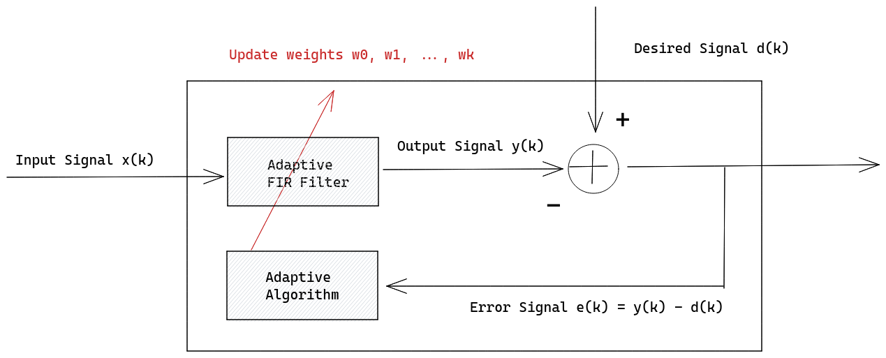
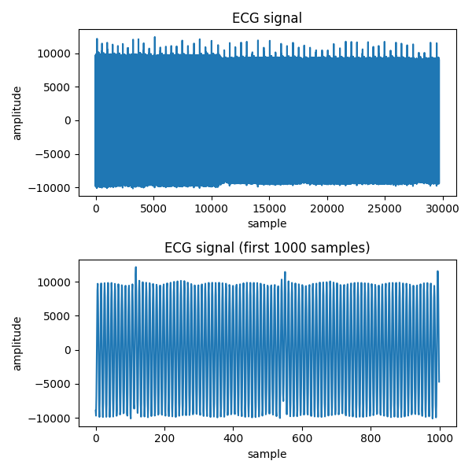
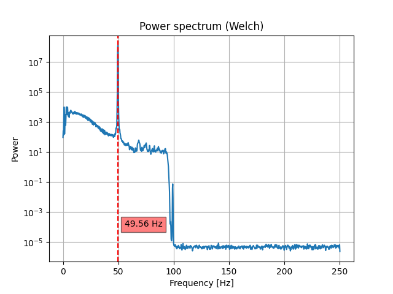
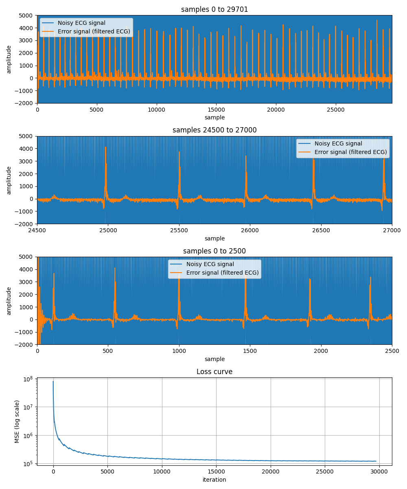
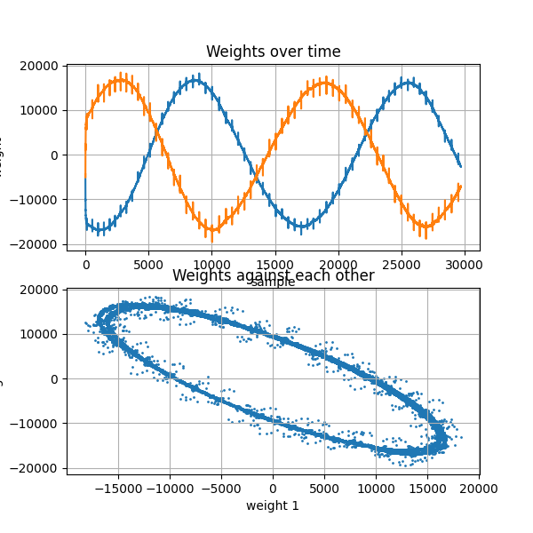
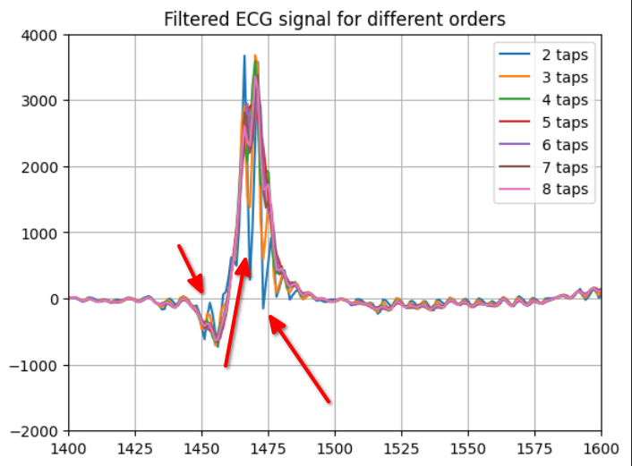
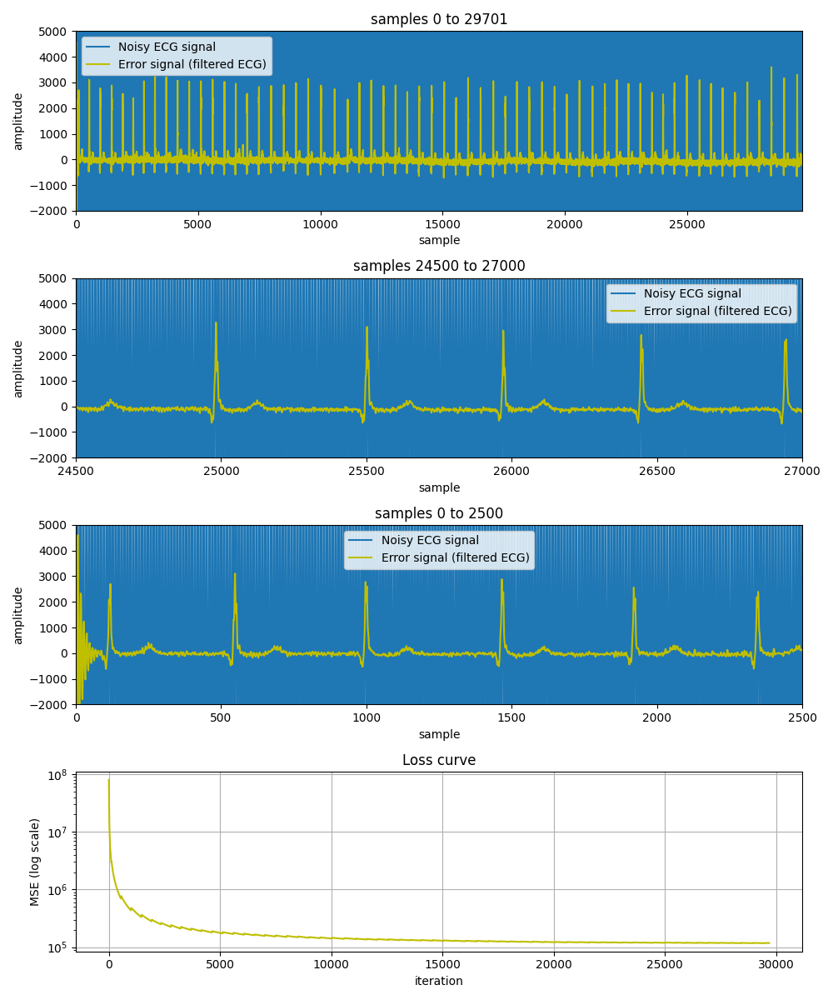
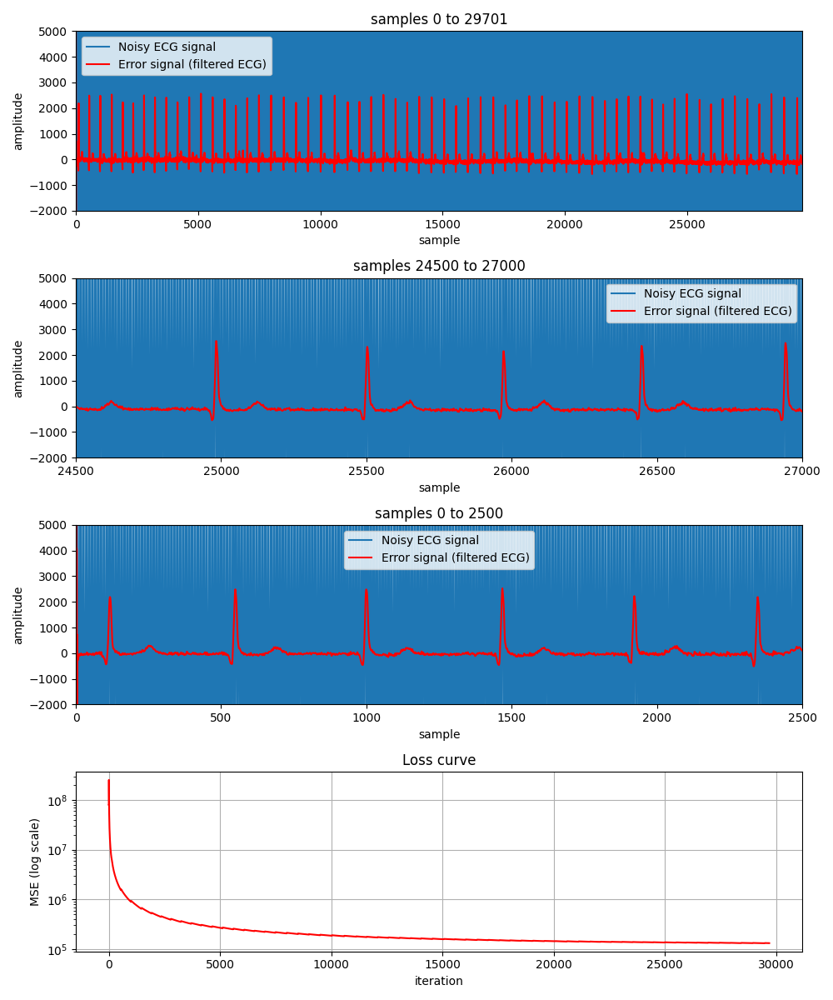
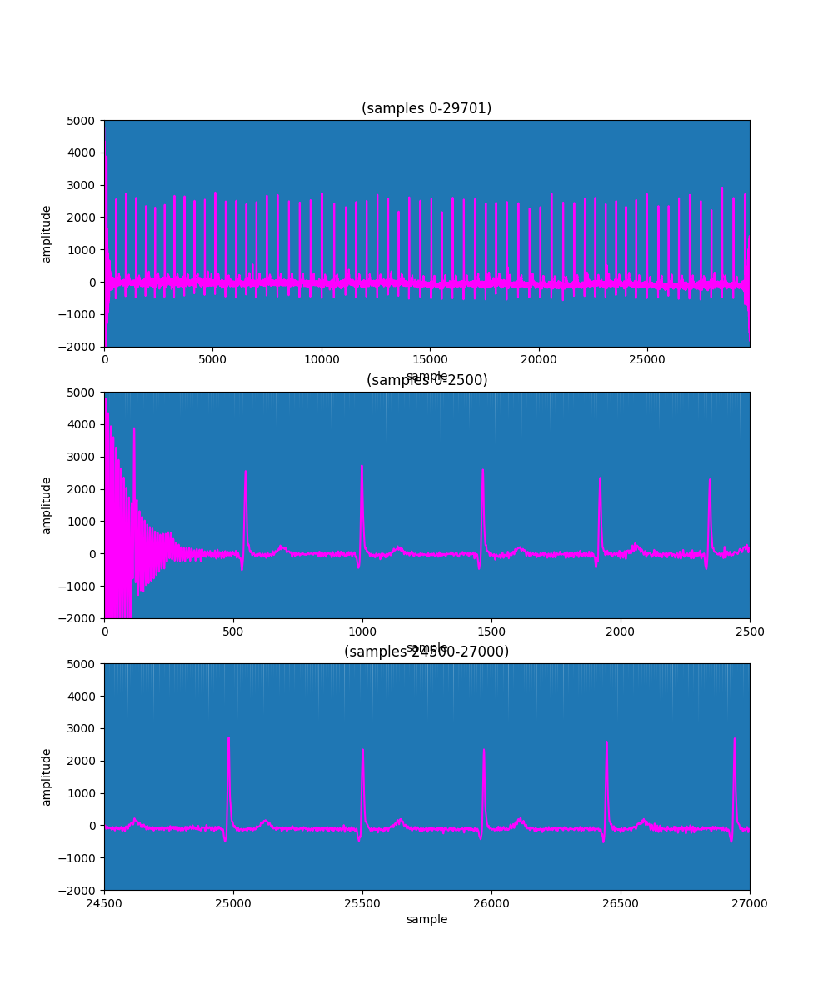
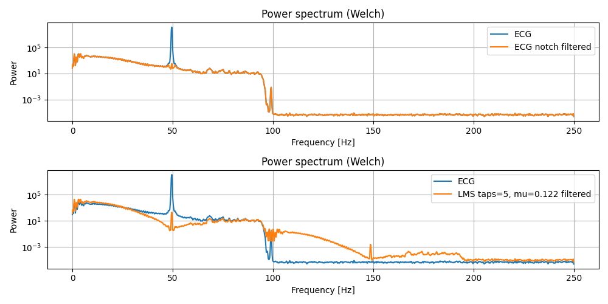

## Introduction

This report covers the topics of adaptive filtering and the LMS algorithm. The report is structured as follows: First, a brief overview of the theory behind the adaptive filtering is presented Then, the algorithms LMS, NMLS and RLS are presented. These algorihms are implemented in python and tested and compared on a sampled electrocardiogram (ECG) signal that contains colored noise from the powerline. Finally, the results are presented and discussed.

## Theory

Adaptive filters are FIR filters that are able to reconfigure themself based on the input signal. This is done by changing the filter coefficients. The filter coefficients are changed by an online quadratic programming algorithm that uses a known desired signal, $d[n]$, and the input signal, $x[n]$, to update the filter coefficients. The filter coefficients are updated in such a way that the filter output, $y[n]$, is as close as possible to the desired signal. This is done by minimizing the mean squared error (MSE) between the desired signal and the filter output. Adaptive filters differentiate themselves based on how they compute the update of the filter coefficients. This leads to different characteristics in terms of computational complexity, convergence speed and robustness to noise. The three most common algorithms are the LMS, NMLS and RLS algorithms. The LMS algorithm is the simplest of the three and is the most computationally efficient. The NMLS algorithm is a more advanced version of the LMS algorithm that is able to adapt to a changing input signal. The RLS algorithm is the most robust of the three and is able to adapt to a changing input signal and noise. The RLS algorithm is also the most computationally expensive of the three. 

The general structure of an adaptive filter is illustrated in Figure 1.  



<!-- ```python

def adaptive_filter(input_signal, desired_signal, n_taps, step_size):
    # Initialize filter coefficients
    # ...

    # loop over all samples

    
    output_signal = np.zeros(len(input_signal))
    for i in range(len(input_signal)):
        output_signal[i] = np.dot(filter_coefficients, input_signal[i])
        error = desired_signal[i] - output_signal[i]
        filter_coefficients = filter_coefficients + step_size * error * input_signal[i]
    return output_signal


# filter

# error

# update weights

``` -->

### LMS (Least Mean Squares) Algorithm

The LMS algorithm is an iterative algorithm that takes as input a measured sample of a signal $\mathbf{x}(k)$ and a desired signal $\mathbf{d}(k)$, where $k$ is the sample index. It tries to mimic the steepest-descent algorithm, where the cost fuction is chosen to be the MSE. The MSE is estimated using the instantanious error $e^2(k)$. The update that minimizes the MSE most, is given by the gradient of the MSE with respect to each tap weight. 
$$
\Delta e^2(k) = 2 \left [ \frac{\delta}{\delta w_{0}}, \frac{\delta}{\delta w_{1}}, \cdots, \frac{\delta}{\delta w_{N-1}} \right] e(k) = -2e(k) \mathbf{x}(k)
$$

The steps of the algorithm are as follows:


1. FIR Filtering

$$y(k) = \mathbf{w}^T \cdot \mathbf{x}(k)$$

2. Error estimation

$$e(k) = d(k) - y(k)$$

3. Tap-weight update

$$w(k+1) = w(k) + 2\mu e(k) \mathbf{x}(k)$$

The update step is defined recursively, and provides a simple procedure to update the tap weights.


<!-- ### Adaptive Line Enhancer -->


<!-- use a delayed version of the input signal as the input signal and the input signal as the desired signal. -->


### NMLS (Normalized LMS) Algorithm

The Normalized LMS algorithm is a modified version of the LMS algorithm. The main difference is that the NMLS algorithm is able to adapt to a changing input signal level. This is done by normalizing the input signal, by its L2 norm. Doing it like this, the step size is independent of the input signal level, which can make it easier to tune the step size. The steps of the algorithm are as follows:

1. FIR Filtering

$$y(k) = \mathbf{w}^T \cdot \mathbf{x}(k)$$

2. Error estimation

$$e(k) = d(k) - y(k)$$

3. Tap-weight update

$$w(k+1) = w(k) + \frac{1}{||\mathbf{x(k)}||^2} e(k) \mathbf{x}(k)$$

In practice, the tap weight update step is modified to avoid division by zero. This is done by adding a small constant to the denominator $\psi$. Secondly, a parameter $\tilde{\mu}$ is introduced to control algorithms rate of convergence.

$$w(k+1) = w(k) + \frac{\tilde{\mu}}{||\mathbf{x(k)}||^2 + \psi} e(k) \mathbf{x}(k)$$

### RLS (Recursive Least Squares) Algorithm

RLS incorporates a forgetting factor, $\lambda$, that makes the algorithm more robust to noise. The forgetting factor is a value between 0 and 1 that determines how much the algorithm should forget about previous samples. A value of 1 means that the algorithm should not forget anything, while a value of 0 means that the algorithm should forget everything. $\lambda$ can be used to control how good the algorithm is at adapting to a changing input signal. If the signal to match is highly non-stationary it is better to set $\lambda$ to a low value, so as to not weight the past, which is likely to be very different from the present. If the signal to match is stationary, it is better to set $\lambda$ to a high value, so as to weight the past more. The steps of the algorithm are as follows:

 
1. FIR Filtering

$$y(k) = \mathbf{w}^T \cdot \mathbf{x}(k)$$

2. Error estimation

$$e(k) = d(k) - y(k)$$

3. Inverse correlation matrix update

The forgetting factor is used to calculate the inverse correlation matrix, $R^{-1}$, which is used to calculate the filter coefficients. The inverse correlation matrix is updated by the following equation:

$$
\mathbf{R}(k) =  \frac{1}{\lambda} \left ( \mathbf{R}(k-1) - \frac{\mathbf{R}(k-1) \mathbf{x}(k) \mathbf{x}(k)^T \mathbf{R}(k-1)}{\lambda + \mathbf{x}(k)^T \mathbf{R}(k-1) \mathbf{x}(k)} \right )
$$

The initial value of the inverse correlation matrix is set to the identity matrix times a small positive constant $\mathbf{R}(0) = \frac{1}{\delta}\mathbf{I}$.

4. Tap-weight update


$$
\mathbf{w}(k+1) = \mathbf{w}(k) + \mathbf{R}(k) \mathbf{x}(k) e(k)
$$)


<!-- $$w(k+1) = w(k) + 2\mu e(k) \mathbf{x}(k)$$ -->


<!-- $y(k) = w^T \cdot x(k)$ -->

<!-- $e(k) = d(k) - y(k)$ -->

<!-- $P(k) = \frac{1}{\lambda} P(k-1) - \frac{P(k-1) x(k) x(k)^T P(k-1)}{\lambda + x(k)^T P(k-1) x(k)}$ -->

<!-- $\Delta w(k) = P(k) x(k) e(k)$ -->


### Notch Filter

A notch filter is FIR filter that is used to remove a specific frequency $w_n$ from a signal. The filter is designed to have a frequency response that is 0 at the frequency that is to be removed. It can be thought of as a
combination of a low pass filter and a high pass filter, where the low pass filter has a cutoff frequency $w_l$ that is lower than the frequency that is to be removed and the high pass filter has a cutoff frequency $w_h$ that is higher than the frequency that is to be removed i.e. $w_l < w_n < w_h$.


---

## Problem Statement

> An ECG signal is sampled at a sampling frequency $Fs= 500\mathrm{Hz}$. The signals contains colored noise
at a frequency of circa $50\mathrm{Hz}$, which is the frequency of the powerline the equipment is connected to. The frequency of
the powergrid is not completely constant over time, which means that the noise is not guaranteed to be stationary. An adaptive filter
can be used to filter out the noise. The filter should be able to adapt to the changing noise.


## Hypothesis

Based on the problem statement, and known theory the following hypothesis can be made: LMS, NMLS and RLS should all capable of filtering out the noise, given that the signal and the noise is mostly stationary. RLS will be slower to compute, but will converge faster. LMS will be faster, but less accurate for the same number of tabs. NMLS will be inbetween LMS and RLS in terms of speed and accuracy.


## Methodology and Results

The sampled ECG signal is plotted in Figure 2. The ECG signal is not discernable from the noise.

<!-- 2 -->



To use an adaptive algorithm to filter out the noise from the ECG signal, a desired signal of the noise is needed. The desired signal
is modeled as a sine wave with frequency $f_{noise}$

$$d = cos(2\pi \cdot f_{noise} / Fs \cdot t)$$

<!-- $$f_{noise} = 49.56\mathrm{Hz}$$ -->

The powerline frequency $f_{noise}$ is estimated using the power spectral density (PSD) of the sampled signal. The PSD is calculated using Welch's method. A plot of the PSD is shown in Figure 3. Most of the signals energy is contained in the noise component, so the single peak at $49.56\mathrm{Hz}$ corresponds to the frequency of the noise $f_{noise}$.

<!-- 3 -->



<!-- How many filter coeffcients are needed in the adaptive filter? -->

### How many filter coeffcients are needed in the adaptive filter?

Since the noise in the signal is colored at a single frequency $f_{noise}$ that varies slightly over time, it should be sufficient to have
**2** taps in the FIR filter. With 1 tap only the gain of the signal can be affected, as the filters system equation will only contain a scalar $H(z) = a$.With 2 taps both the gain and phase of the signal can be affected, as $H(z) = a + bz^-1$, which together is enough to attenuate the noise frequency $f_{noise}$.


### Select an appropriate value for the step-size $\mu$.

Equation 6.73 from the book, provides a formula to calculate the max step-size $\mu$ for the LMS algorithm, before the filter coefficients start to diverge.

$$
\mu_{max} = \frac{1}{3\sum_{i=0}^{N-1} \lambda _{i}} = \frac{1}{3 \mathrm{tr}[R]}
$$

Where $N$ is the number of tabs in the FIR filter, and $\lambda _{i}$ is the $i$'th eigenvalue of the auto correlation matrix $R$.

And equation 6.74 gives an analytical inequality that describes the interval for the LMS algorithm, given the parameter $\mu$, where the algorithm remains stable. The inequality is given by

$$
0 < \mu < \frac{1}{3 \mathrm{tr}[R]}
$$

where $R$ is the autocorrelation matrix of the input signal $x(k)$.

Using python the upper bound of the inequaity was found to be $0.31$. The step-size $\mu$ was set to $0.3$.

### Using LMS with 2 taps, and $\mu = 0.3$.


<!-- 4 -->



In Figure 5 the evolution of the filter coefficients are plotted. The filter coefficients are initialized to 0. The plot showes a strange progression for both weights, as they oscilate in a periodic, non decaying pattern. The theorectical expectation is that the filter coefficients should converge to a fixed value, with some excess to the theoretical optimum $w_{o}$ called the misadjustment. As the step size has been selected to be within the stability interval. A possible explanation for this could be that the noise is not stationary, and the filter is not able to adapt fast enough to the changing noise. Yet when you look at filtered error signal, the adaptive filter is able to remove the noise, and reconstruct the ECG signal to a certain degree.

<!-- 5 -->



### Using SNR to determine the best combination of taps and $\mu$.

The signal to noise ratio (SNR) is a measure of the signal quality. The SNR is defined as the ratio between the power of the signal and the power of the noise. The SNR is given by the following equation:

$$
SNR = 10 \log_{10} \left( \frac{P_{signal}}{P_{noise}} \right)
$$

As the power of the noise is not known an estimate of the noise power is used. The noise power is estimated by subtracting the error signal i.e. the ECG component, from the sampled signal.

Different combinations of taps and $\mu$ were tested, and the SNR was calculated for each combination. Each tap in the range $N \in \left \lbrace 2,3,\cdots, 8\right \rbrace$ where tested. For each tap, the maximum $\mu$ needed for the algorithm to remain stable was found, using equation $6.73$, and `np.arange(0.0, mu_max, 5)[1:]` was used to generate a list of $\mu$ values to test. The SNR was calculated for each combination of taps and $\mu$. The combination with the highest SNR was selected as the best combination. The 5 best results are shown in Table 1.

| Taps | $\mu$ | SNR (dB) | MSE |
|------|-------|-----|--|
|  5 |  0.122 | -24.544121 | 157418.81 |
|  6 | 0.101 | -24.617290 | 154793.82 |
|  8 | 0.076 | -24.640423 | 153982.03 |
|   7 | 0.087 | -24.675890 | 152724.2 |
|    4 | 0.152 | -24.687187 |  152312.28 |


Looking at the plot, Figure 6, of the best combination of taps and $\mu$ in Figure 4, it is clear that the noise is removed, and that the ECG signal is discernable. Comparing it with $N = 2$ and $\mu = 0.3$, it is clear that the noise is removed more effectively, as the error signal is smoother and contains less variation. Furthermore, the initial imprecision, from sample 0 to 200, in the error signal is not present, as it is for $N = 2$ and $\mu = 0.3$, even thougth the MSE that both convergence towards are largely equal.

<!-- 6 -->


### Why more than 2 taps are needed to remove the noise.

This can be investigated further by zooming in at a single peak in the filtered ECG signal, and looking at how the different filters with different number of taps $N$ matches the shape of a single ECG heartbeat peak. The plot in Figure 5, shows that the error signal for taps 2,3 and contains components of a high frequency term, that causes a larger variation in the signal around, the lower frequency peak of the heartbeat. For taps 5,6,7 and 8, the error signal is smoother, and the variation around the lower frequency peak is smaller. This is because FIR filter has more terms/coefficients to handle the additional frequencies in the measured signal, rather than just the noise frequency $f_{noise}$. I am not sure whether the additional frequency, is separate from the powerline frequency, or if it is due to the powerline frequency being slightly non stationary. In either case, the modeled noise is not a good enough approximation of the noise in the signal, and the FIR filter need to tune more coefficients to handle the additional frequencies.

<!-- 7 -->


---

### Using NMLS

Using the same initial parameters for $N$ and $\mu$ as for the LMS algorithm, the NMLS algorithm was tested. The results are shown in Figure 8. The NMLS algorithm is able to remove the noise, and reconstruct the ECG signal. The error signal is smoother than for the LMS algorithm, with the same number of taps, which is a desireable improvement although with more taps the LMS algoritm is capable of producing a better result. Both the NMLS and LMS algorithm have the about the same convergance rate, as can be seen on their respective loss curves, and the initial 150 samples. The litterature (chapter 6 in the book) states that the NMLS algorithm is more robust to non-stationary noise, and that it is able to handle a larger step size $\mu$. While there is a noticeable difference in the error signal for the NMLS algorithm, for the same amount of taps, it does not seem to be a large enough difference to justify the additional computational complexity of the NMLS algorithm, compared to the LMS algorithm.

<!-- 8 -->


---

### Using RLS

The RLS algoritnm has been tested in a similar way as the NMLS algorithm, with only one permutation of taps and forgetting factor $\lambda$ shown in Figure 10. The same number of taps $N=2$ was selected as to be comparable with the experiments performed with the LMS and NMLS algorithms. The forgetting factor was tuned by trial and error and set to $\lambda = 0.8$ as it provides a good overall result. The effect of the forgetting factor is illustrated in figure 9. The figure shows that the forgetting factor $\lambda$ is a tradeoff between the noise being removed, and the ECG signal being reconstructed. A high value $\lambda = 0.99$ introduces a lot of variation in the error signal, making it hard to observed the ECG signal, between heartbeat peaks. A low value $\lambda = 0.5$, on the other hand, makes the error diverge by a huge amout. The value of $\lambda = 0.8$ is a good compromise between the two, as it removes the noise, and the ECG signal is reconstructed well.

<!-- 9 -->


Figure 10 shows that the RLS algorithm is able to remove the noise, and reconstruct the ECG signal. The error signal is smoother than both the LMS and NMLS algorithm, with the same number of taps, which is a desireable improvement. Another improvement is the convergence rate. Although the rate at which the loss curve for RLS is decreasing is largely similar to that of the LMS and NMLS algorithm, the third plot in figure 10 shows that the initial "wind up" that the other two algorithms is not present here. The RLS algorithm is much faster at tuing into the correct signal, only a handful of samples rather than around 150 samples. This result is in accordance to the theory in the book, where it is stated that the RLS algorithm is capable of tuning in to the steady-state error of the the weights faster that the other two algorithms.



---

### Using a Notch filter

Since the noise is colored at a single frequency, a notch filter can be used to remove the noise. Scipy's signal package contains a function that can be used to design a notch filter. The filter is designed using the following code snippet:

```python
Q = 30.0  # Quality factor, controls the width of the notch.
b, a = sp.signal.iirnotch(powerline_freq, Q, fs=Fs)
ecg_notch = sp.signal.filtfilt(b, a, ecg)
```

Looking at Figure 11 the filtered output of the notch filter it does a good job at filtering out the noise similar to the NMLS at $N=2$. But in comparion to the other three algorithms it has a large initial error, and takes around 350 samples to converge at the steady-state error. Which is undesireable.

<!-- This is due to the fact that the notch filter is a linear filter, and the noise is colored at a single frequency. The notch filter is not able to remove the noise at the other frequencies, and the error signal is therefore not able to converge to the steady-state error. The notch filter is therefore not a good choice for this problem. -->

<!-- 11 -->


Computing the PSD of the filtered signal produced by the notch filter, shows that the noise is indeed removed, and that every other frequency is unaffected, see Figure 12. The notch filter is therefore able to remove the noise, without affecting the ECG signal. In comparison the PSD of the filtered signal produced by the LMS algorithm, affects other frequencies than the noise frequency $f_{noise}$, which is not desireable, in the case where the noise is colored at a single frequency.

<!-- 12 -->



### Computational Complexity of the Algorithms

Using jupyterlabs magic function `%timeit` the computational complexity of the algorithms was measured. The results are shown below in monospace text. The LMS algorithm is the fastest, followed by the NMLS algorithm, and the RLS algorithm is the slowest. The RLS algorithm is the slowest, as it has to calculate matrix multilications in each update step, which is a computationally expensive operation. The NMLS algorithm is faster than the RLS algorithm, as it does not have to calculate the product of two matrices, but it still has to compute an inner product and a division more at each update step compared to the LMS algorithm. The LMS algorithm is the fastest, as it has the fewest number of arithmetic operations to perform in each update step.


<!-- lack of time to make table  -->

`LMS(taps=2,mu=0.3) 1.13 s ± 49.2 ms per loop (mean ± std. dev. of 7 runs, 1 loop each)`

`NMLS(taps=2, mu=0.3,psi=0.1) 1.35 s ± 49.5 ms per loop (mean ± std. dev. of 7 runs, 1 loop each)`

`RLS(taps=2, forgetting_factor=0.8) 2.99 s ± 295 ms per loop (mean ± std. dev. of 7 runs, 1 loop each)`


### Convergence rate of the Algorithms towards the steady-state error

Figure 13 shows a suprising result. The convergance rate of each algorithm are largely the same, and they converge towards the same steady-state error. For the first 5000 samples the rate of convergeance for the LMS algorithm is sligtly faster that the other two, with RLS being the slowest of them. This does not match the theory in the book, where it is stated that the RLS algorithm is capable of converging much faster that the other two algorithms. This diviation from theory might be due to properties of the input signal, or more likely that a mistake of some sort has been in the implementation of the algorithms presented.

<!-- 13 -->


## Conclusion

All the investigated algorithms were able to remove the noise from the ECG signal. The LMS algorithm was the fastest, and the RLS algorithm was the slowest. Given the noise being colored at a single frequency, a notch filter was also tested. The notch filter was able to remove the noise, without affecting the ECG part of the signal, but introduced a large initial error.

For $N= 2$ the RLS algorithm was the most accurate, with the LMS algorithm being the least accurate.The NMLS algorithm was in between the LMS and RLS algorithms in terms of accuracy and computational complexity. While the RLS was more accurate than the others is also around 3 times slower than the LMS algorithm. Depending on the application the LMS algorithm might be a better choice than the RLS algorithm, as it is faster, and the difference in accuracy is not that large. The NMLS algorithm is a good compromise between the LMS and RLS algorithm, as it is faster than the RLS algorithm, and more accurate than the LMS algorithm. With at larger number of taps the LMS algorithm can perform as well as the RLS algorithm, with the added benefit of being faster, as shown with the results for $N=5$ and $\mu=0.112$. 
